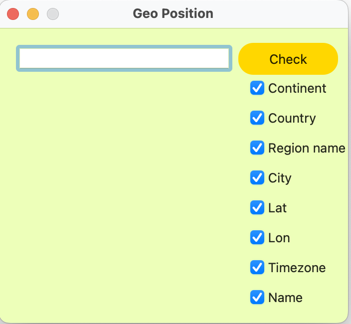
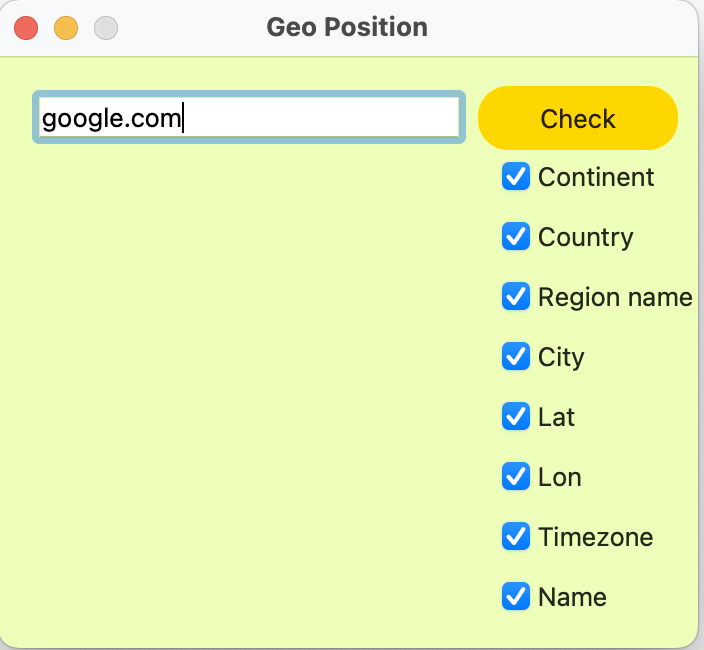
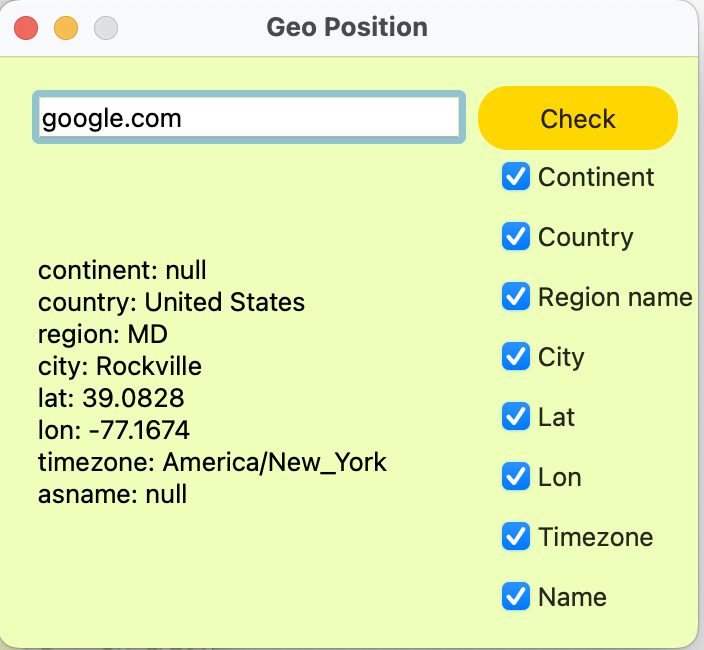
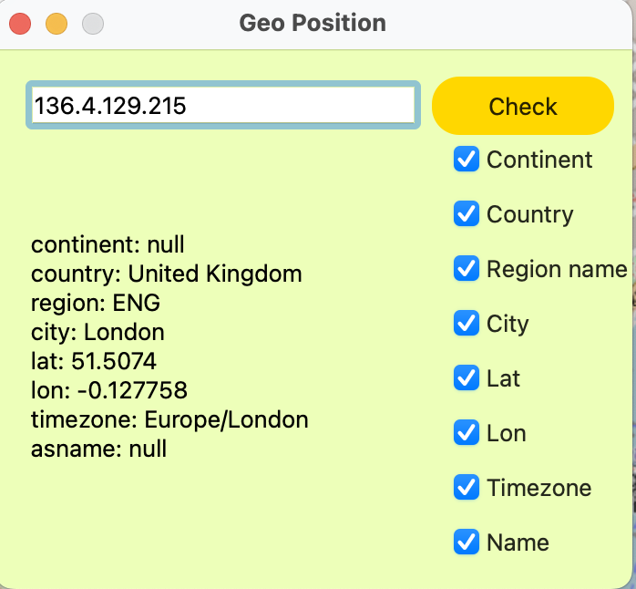

# GeoApi

## Preview

----------------------

Support dns-address

----------------------

Output info about google.com

----------------------

Support ip-address

----------------------

Browser output with random ip-address

## Installation instruction

1) Go to terminal
2) Paste this text to terminal one by one

> git clone https://github.com/ket03/GeoApi.git

> cd GeoApi

> make install

> open build
 
 ## Other
Also you can:

Uninstall app
> make uninstall

Сlean up the trash
> make clean

Archive directory
> make dist

Open Readme.md
> make dvi